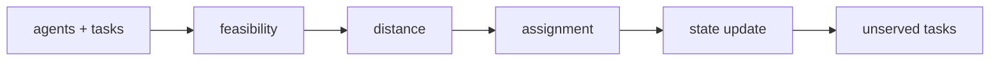

# Architecture

## Agent state
Each agent has a name, 2-D position, and remaining capacity.

## Task state
Each task has a location and load requirement.

## Feasibility
Only agents with sufficient remaining capacity are candidates.

## Greedy coordinator
Chooses the nearest feasible agent, then updates capacity and position.

## Principle
Start with a transparent coordination baseline whose failures can be measured before adding learning.
